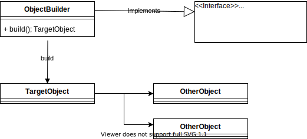
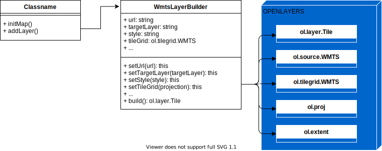

# builder

* [Español](#español)
   * [Descripción](#descripción)
   * [Cuando](#cuando)
   * [Cómo](#cómo)
* [English](#english)
   * [Description](#description)
   * [When](#when)
   * [How](#how)

# Español 
Patrón Builder usando Javascript &amp; Openlayers.

### Descripción:
Builder es un patrón simple y útil que permite crear objetos complejos paso a paso a través de uno más simple.
   * Respetar el principio de Responsabilidad Única.

### Cuando:
   * Cuando necesitemos evitar los constructores complejos con muchos párametros que pueden ser opcionales o no.
   * Cuando necesitemos que el código pueda crear diferentes representaciones de los productos.
   * Para construir arboles jerarquicos con el patrón **Composite**.
   * Para ocultar la complejidad de la creación de objetos determinados.

### Cómo:
Diagrama de clases UML del patrón:

   * **IBuilder**: Componente no obligatorio que define la estructura de los Builder de la aplicación.
   * **ObjectBuilder**: Clase que se utiliza para crear los **TargetObject**, debe tener un método build() para crear los **TargetObject** y los demás métodos deben devolver la instancia de **ObjectBuilder** creada.
   * **TargetObject**: Objeto simple o complejo que se crea mediante el **ObjectBuilder**.
   * **OtherObject**: Otros objetos que puede contener **TargetObject** si es complejo y que es necesario crearlos mediante el **ObjectBuilder**.

Para este patrón se utilizará un ejemplo básico pero real de su uso en Javascript junto con Openlayers. Delegaremos a una clase builder la creación de una capa WMTS, creando paso a paso objetos cómo: el tipo de capa, source, proyección, etc. 

Diagrama de clases UML del ejemplo:

   * **MapService**: Clase que crea el mapa y añade la capa a él.
   * **WmtsLayerBuilder**: Clase builder que crea la capa de Openlayers y sus diferentes objetos internos necesarios .
   * **ol.layer.Tile**: Capa de Openlayers.
   * **ol.source.WMTS**: Origen de datos para la capa de Openlayers.
   * **ol.tilegrid.WMTS**: Objeto de Openlayers necesario para la creación de la capa.
   * **ol.proj**: Objeto de Openlayers necesario para la creación de la capa.
   * **ol.extent**: Objeto de Openlayers necesario para la creación de la capa.

La clase **MapService** inicializará el mapa y añadirá una capa a él mediante la clase **WmtsLayerBuilder**, la clase **WmtsLayerBuilder** contiene todo lo necesario para crear la capa de Openlayers paso a paso y devolverla mediante el método *build()*.

# English 
Builder Pattern using Javascript &amp; Openlayers.

### Description:
...
### When:
...
### How:
...

