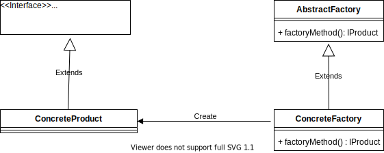
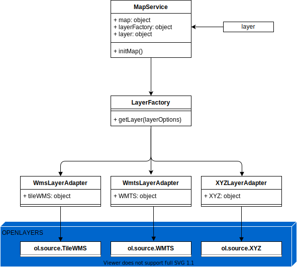
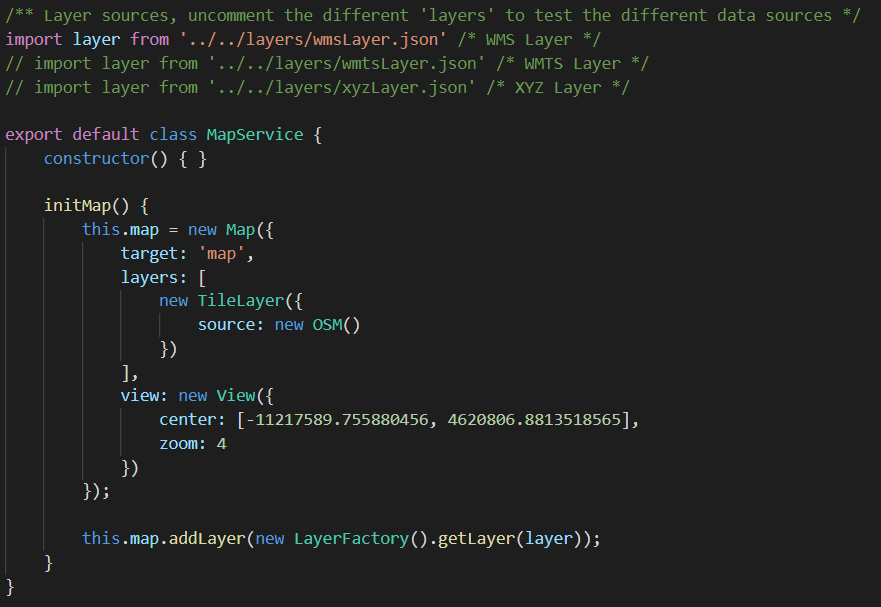
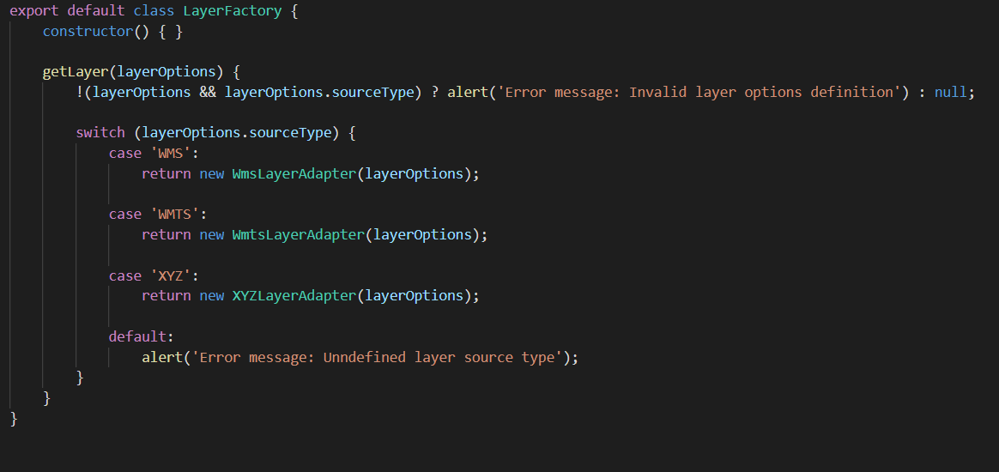

# factory-method

* [Español](#español)
   * [Descripción](#descripción)
   * [Cuando](#cuando)
   * [Cómo](#cómo)
* [English](#english)
   * [Description](#description)
   * [When](#when)
   * [How](#how)

# Español 
Patrón Factory Method usando Javascript &amp; Openlayers.

### Descripción:
Factory Method crea objetos de un subtipo determinado a través de una clase Factory. Es útil cuando al diseñar no se sabe que subtipo se va a utilizar, sospechamos que añadiran nuevos subtipos o cuando se quiere delegar la lógica de la creación de los objetos sobre una clase, en este caso una clase Factory. Con este patrón se puede conseguir crear objetos de manera dinámica haceiendo uso de archivos de configuración, XML, properties, consultas a base de datos, etc. Con este patrón conseguimos:
   * Evitar el acoplamiento entre la creación de los objetos y las subclases.
   * Respetar el principio de Responsabilidad Única.
   * Respetar el principio de Open/Close.

### Cuando:
   * Cuando al diseñar no se conoce que subclase se utilizará.
   * Cuando se necesita delegar el control de la creación de objetos mediante una interfaz común.
   * Cuando la creación de un objeto se basa en condicionales *(if/else, switch)*.
   * Cuando queremos dar la opción de a futuro extender los componentes internos.

### Cómo:
Diagrama de clases UML del patrón:

   * **IProduct**: Estructura de los objetos que queremos crear.
   * **ConcreteProduct**: Implementación concreta que es creada a través de la clase **ConcreteFactory**.
   * **AbstractFactory**: Definición del comportamiento por defecto de **ConcreteFactory** *(componente opcional)*.
   * **ConcreteFactory**: Fabrica concreta para la creación los **ConcreteProduct**.

Para este patrón se utilizará un ejemplo básico pero real de su uso en Javascript junto con Openlayers. Delegaremos a las clases del patrón la creación de las diferentes orígines de datos para las difentes capas del mapa. En este ejemplo se crearán TileLayers que utilizarán diferentes tipos de orígenes de datos, en concreto servicios WMTS, WMS y XYZ, pero esto se podría extender y dar la opción de crear diferentes tipos de capas, y otros origenes de datos. 

Diagrama de clases UML del ejemplo:

   * **MapService**: Clase que crea el mapa y añade la capa a él.
   * **layer**: Archivo JSON con los datos de la capa a añadir.
   * **LayerFactory**: Clase que representa el **ConcreteFactory**.
   * **WmsLayerAdaptor**: Clase que representa uno de los **ConcreteProduct**.
   * **WmtsLayerAdaptor**: Clase que representa uno de los **ConcreteProduct**.
   * **XYZLayerAdaptor**: Clase que representa uno de los **ConcreteProduct**.

La clase **MapService** inicializará el mapa, leera los parámetros de la capa a añadir de los diferentes archivos JSON y se los pasará a la clase **LayerFactory** para crear la capa. **LayerFactory** recibirá los parámetros de la capa a crear, comprobará el tipo de origen de datos y creará uno de los **ConcreteProduct** disponibles.

Para el comprobara el uso de los diferentes origenes de datos comentamos/descomentamos la lectura de los diferentes archivos JSON dentro de **MapService**.

Para añadir nuevos origenes de datos se crean nuevos archivos JSON, **ConcreteProduct** y se añade una nueva opción al condicional de la clase **LayerFactory**, respetando así el principio Open/Close.

# English 
Factory Method Pattern using Javascript &amp; Openlayers.

### Description:
...
### When:
...
### How:
...
